# Онлайн-запись для салона, клиники или студии

Клиент записывается к мастеру без регистрации: выбирает услугу, мастера и свободное время, оставляет имя и телефон. Администратор ведёт записи в календаре, подтверждает, переносит и отменяет их. Клиент получает напоминания за сутки и за 2 часа по email или в Telegram.

Подходит салонам красоты, барбершопам, клиникам, репетиторам и студиям — всем, кто работает по записи.

**[Открыть демо](https://round-shadow-07bd.mkeyboard138.workers.dev/)** · [админка](https://round-shadow-07bd.mkeyboard138.workers.dev/admin) (`admin@example.com` / `password`)

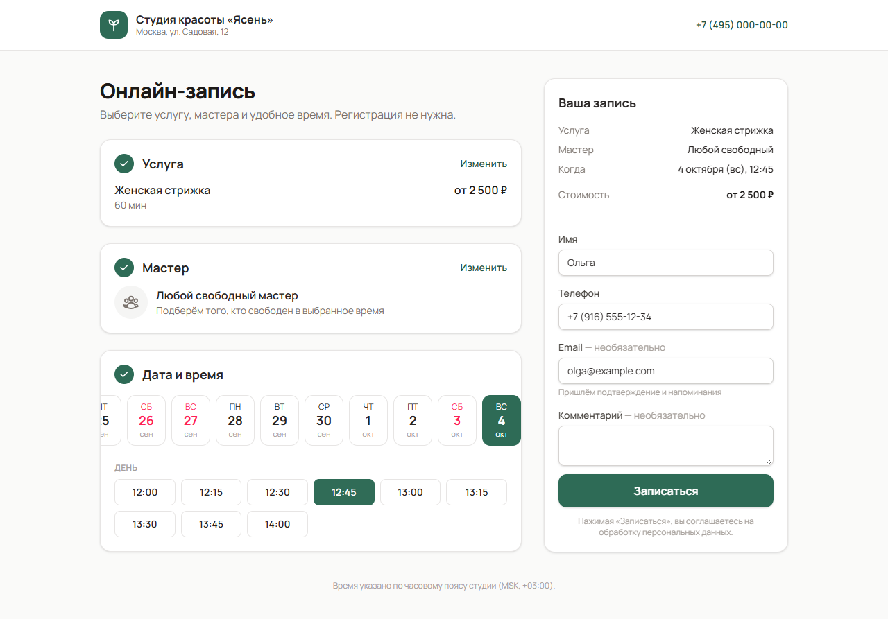

## Возможности

**Для клиента**
- Каталог услуг с ценой и длительностью, выбор мастера или «любого свободного».
- Только реально свободное время: учитываются рабочие часы, перерывы, выходные, отпуска и уже занятые записи.
- Запись без регистрации — имя и телефон. Повторного клиента узнаём по номеру в любом формате (`8 916…`, `+7 (916)…`).
- Личная ссылка на запись: посмотреть детали и отменить.
- Уведомления о создании, подтверждении, переносе и отмене; напоминания за сутки и за 2 часа — на email и в Telegram.
- Личный кабинет без пароля: вход по одноразовому коду из Telegram или письма. В кабинете — предстоящие записи с переносом и отменой, история визитов с итогами и кнопкой «Записаться снова», контакты и подключение Telegram.
- Адаптивная вёрстка для телефона.

**Для администратора** (Filament)
- Календарь с колонками по мастерам; перенос записи перетаскиванием с проверкой свободного времени.
- Записи с вкладками «Сегодня», «Ждут подтверждения», «Предстоящие»; действия «Подтвердить», «Перенести», «Отменить с причиной», «Выполнена».
- Запись клиента по телефону: форма предлагает только свободное время.
- Услуги (цена, длительность, буфер на уборку), мастера (график, перерывы, свои цены и длительность), исключения из графика (отпуск, короткий день, выход в выходной).
- Клиенты с историей визитов, суммой и отменами.
- Инфопанель: записи и выручка дня, выручка недели, ожидающие подтверждения; оповещения о новых записях и отменах в колокольчике.

| Календарь | Инфопанель |
|---|---|
| 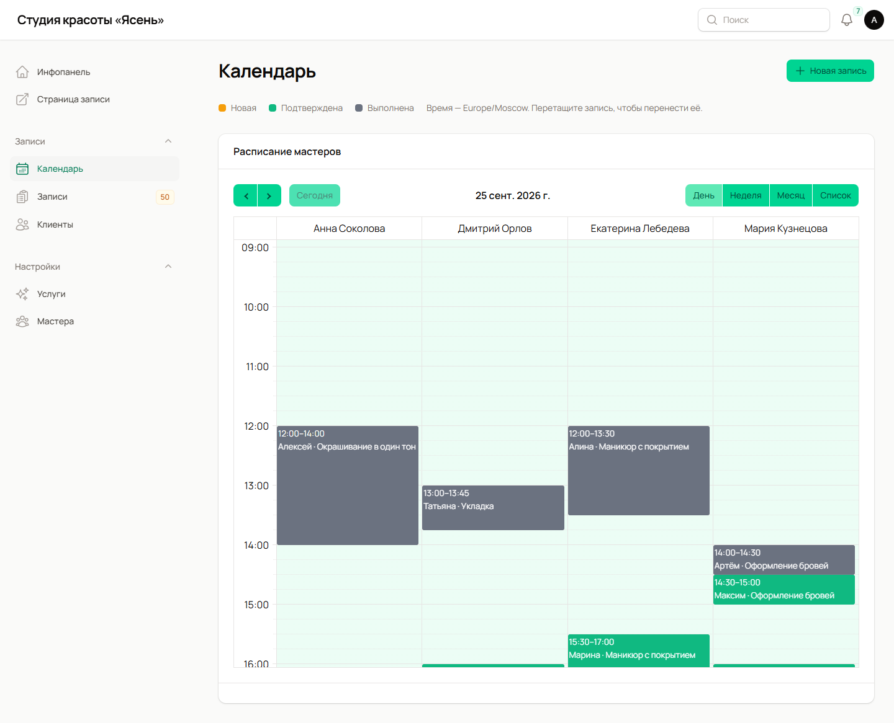 | 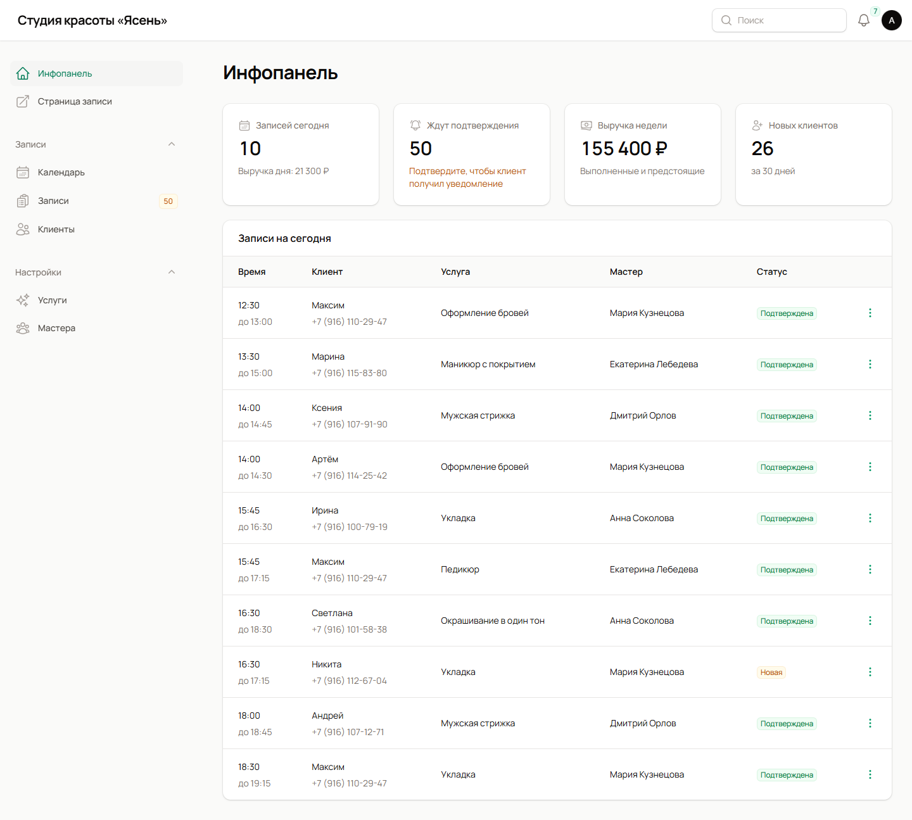 |

| Страница записи клиента | Мобильная версия |
|---|---|
| 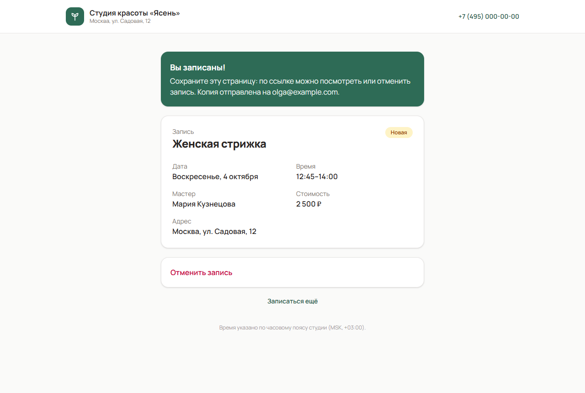 | 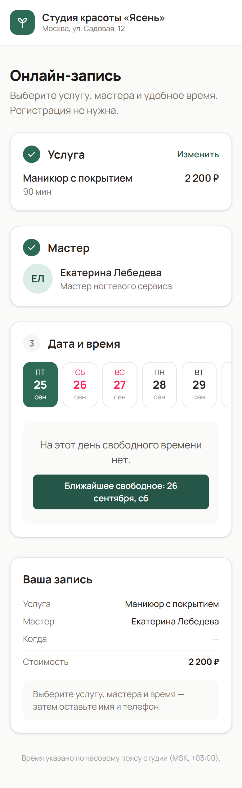 |

| Личный кабинет | Перенос записи |
|---|---|
| 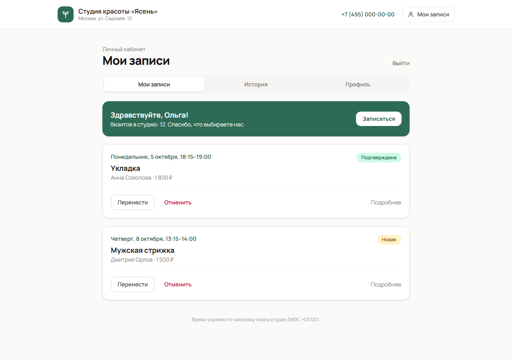 | 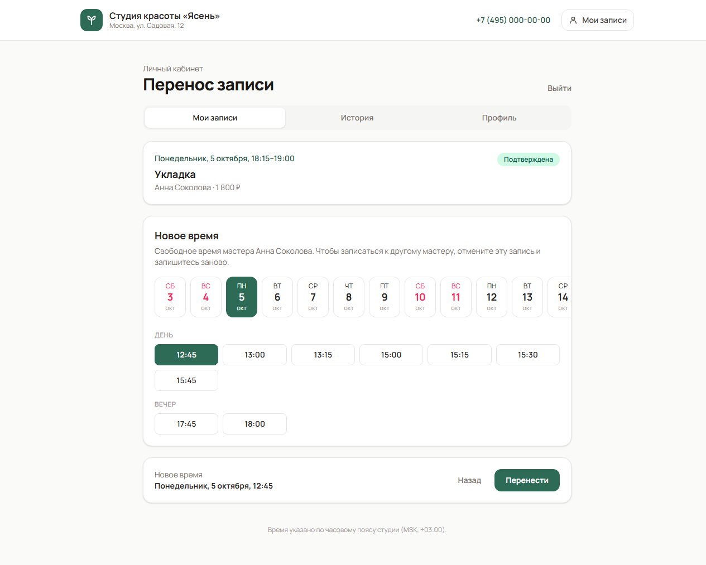 |

| Вход по коду | История визитов |
|---|---|
| 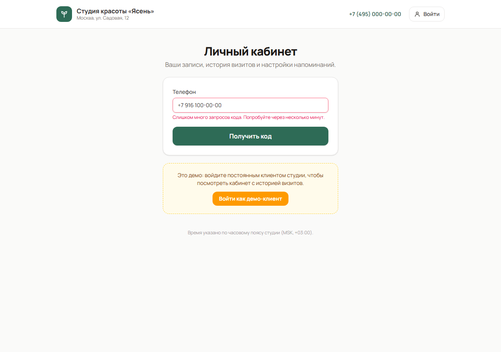 | 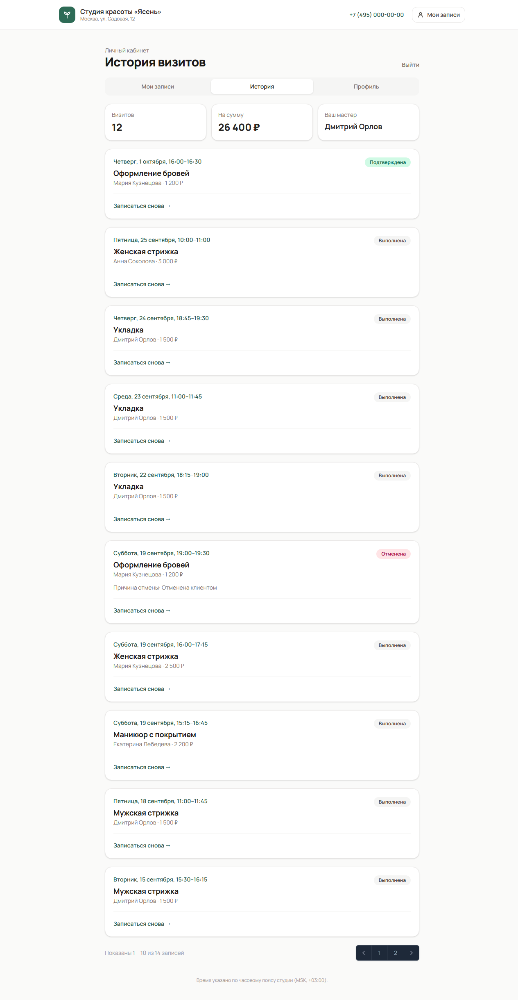 |

| Записи | График мастера | Запись по телефону |
|---|---|---|
| 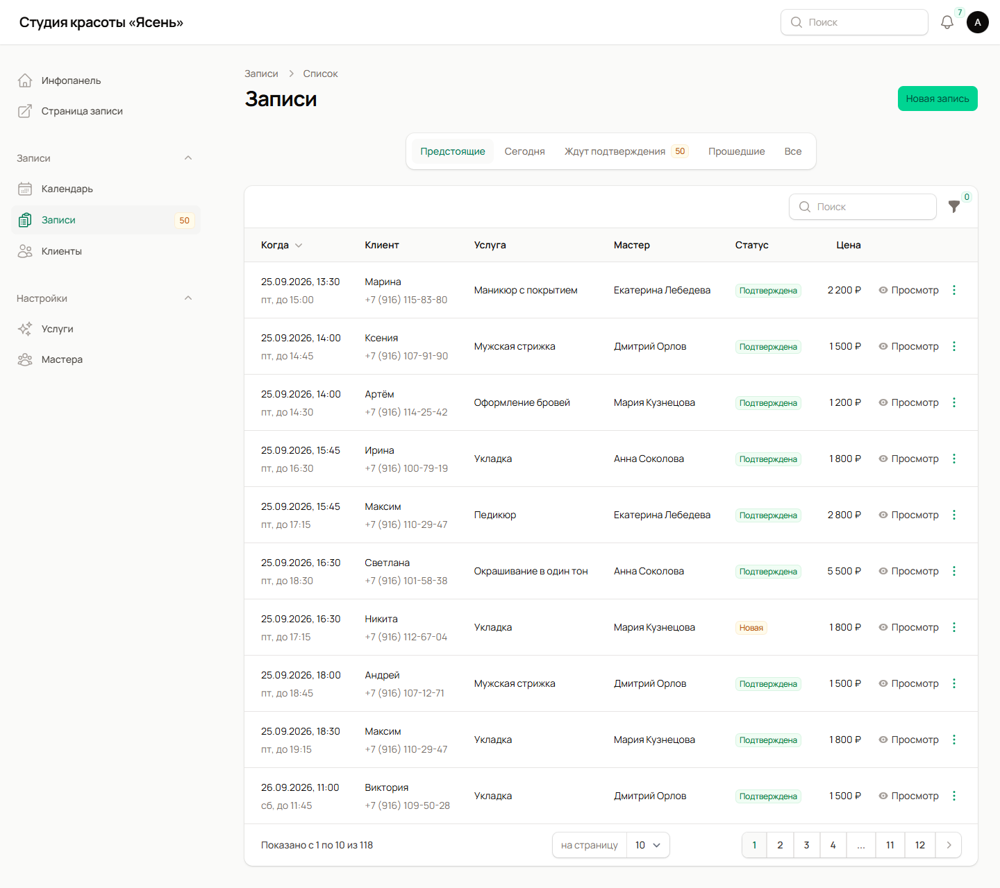 | 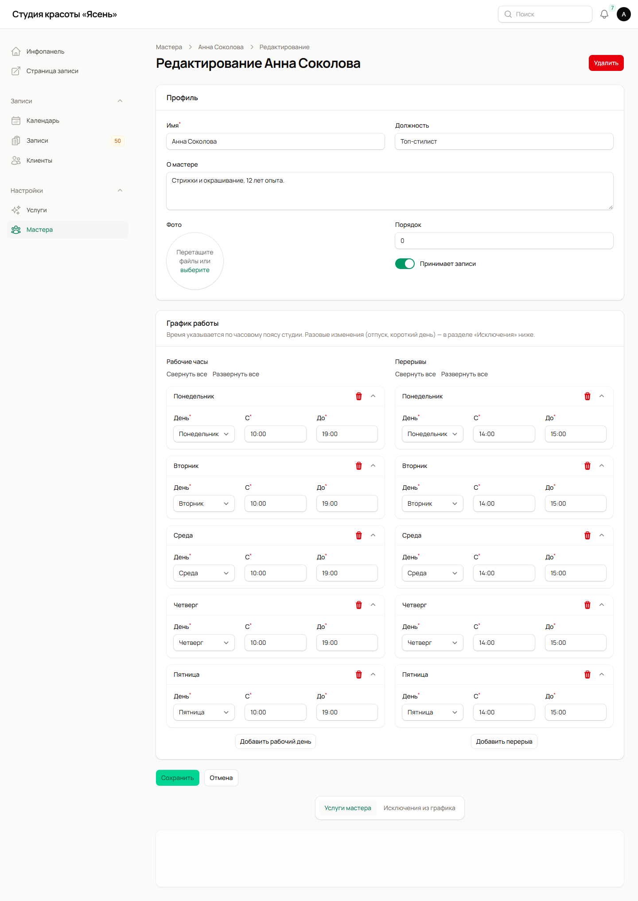 | 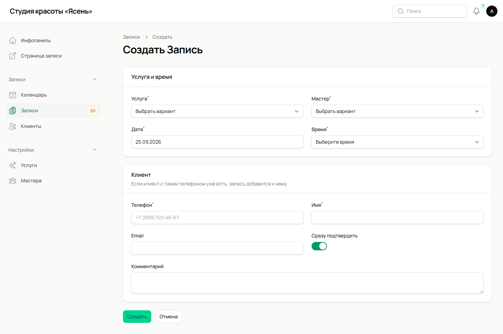 |

## Демо

- Страница записи: https://round-shadow-07bd.mkeyboard138.workers.dev/
- Админка: https://round-shadow-07bd.mkeyboard138.workers.dev/admin — логин `admin@example.com`, пароль `password` (форма входа заполнена сама).
- Личный кабинет клиента: https://round-shadow-07bd.mkeyboard138.workers.dev/cabinet — кнопка «Войти как демо-клиент».
- Бот напоминаний: [@BookingLaraBot](https://t.me/BookingLaraBot) — подключается кнопкой на странице записи.

Демо-данные: студия красоты с 4 мастерами, 7 услугами и примерно 300 записями на две недели назад и вперёд.

## Стек

- Laravel 13, PHP 8.4, MySQL 8
- Filament 5 (админка), Livewire 4 + Tailwind CSS 4 (публичная страница)
- [guava/calendar](https://github.com/GuavaCZ/calendar) — календарь в админке
- Очереди и планировщик Laravel — уведомления и напоминания
- Telegram Bot API — напоминания в Telegram
- Pest — 184 теста

## Как устроен расчёт свободного времени

Главная логика проекта вынесена в отдельный сервис и покрыта юнит-тестами.

- **`SlotCalculator`** — чистый класс без базы данных. На вход: расписание дня, длительность услуги, буфер, занятые интервалы, шаг сетки и «не раньше чем». На выход: список свободных начал записи в UTC.
- **`SlotService`** — собирает для него данные из БД: недельный график или исключение на дату, перерывы, активные записи мастера с их буферами.

Правила:
1. Интервалы полуоткрытые `[начало, конец)`: запись 10:00–11:00 не мешает записи 11:00–12:00.
2. Услуга целиком помещается в рабочие часы; запись, которая заканчивается ровно в момент закрытия, разрешена.
3. Услуга не задевает перерыв; буфер (уборка) может выходить за конец дня и совпадать с перерывом.
4. Услуга вместе с буфером не пересекается с другими активными записями. Отменённые записи время не занимают.
5. Время начала — не раньше, чем через заданный запас от текущего момента, и в пределах горизонта записи.
6. Сетка строится от начала каждого рабочего интервала с заданным шагом (по умолчанию 15 минут).

**Двойная запись.** Проверка и создание записи идут в одной транзакции под блокировкой строки мастера (`SELECT … FOR UPDATE`). Второй клиент, выбравший то же время, получит сообщение «Это время уже занято».

**Часовые пояса.** Все моменты времени хранятся в UTC, а показываются в поясе бизнеса (`BOOKING_TIMEZONE`). График мастера («пн 10:00–19:00») хранится в местном времени и переводится в UTC для конкретной даты — поэтому переход на летнее и зимнее время учитывается автоматически. Это проверено тестами на Берлине, Москве и Владивостоке.

## Личный кабинет клиента

**Вход без пароля.** Клиент вводит телефон и получает шестизначный код в Telegram и на email, привязанные к этому номеру. Код хранится в виде хеша, действует 10 минут, после пяти неверных попыток сгорает. Число запросов кода ограничено и на номер, и на IP. Ответ одинаковый для любого номера, поэтому по форме входа нельзя узнать, кто клиент студии.

**Почему не SMS.** SMS стоит денег, а Telegram и email у клиента уже есть — через них приходят напоминания. Телефон при записи без SMS не подтверждается, поэтому каналы для кодов защищены от подмены: email из анонимной формы записи не заменяет уже сохранённый, а к номеру, у которого уже есть Telegram, нельзя привязать другой чат. SMS-шлюз (SMS.ru, SMSC) подключается как ещё один канал уведомлений.

**Перенос и отмена.** Клиент сам отменяет или переносит запись не позже чем за час до начала (`BOOKING_CLIENT_CHANGE_DEADLINE`). Перенос — на свободное время того же мастера, с той же проверкой и блокировкой, что и новая запись. Перенесённая запись снова ждёт подтверждения, администратор получает оповещение в колокольчике.

**Изоляция.** У клиентов свой guard `client` и своя таблица — админка и кабинет не пересекаются. Клиент видит и меняет только свои записи: чужая запись для него не существует (404).

## Установка

```bash
git clone <репозиторий> online-booking && cd online-booking
composer install
cp .env.example .env
php artisan key:generate
# указать доступ к MySQL в .env
php artisan migrate --seed
npm install && npm run build
php artisan serve
```

Очередь и планировщик:

```bash
php artisan queue:work
php artisan schedule:work
```

На виртуальном хостинге без постоянных процессов достаточно cron `* * * * * php artisan schedule:run` и `BOOKING_SCHEDULED_QUEUE_WORKER=true` — тогда очередь разбирается через планировщик.

### Настройки `.env`

| Переменная | Назначение | По умолчанию |
|---|---|---|
| `BOOKING_TIMEZONE` | Часовой пояс бизнеса | `Europe/Moscow` |
| `BOOKING_SLOT_STEP` | Шаг сетки времени, мин | `15` |
| `BOOKING_MIN_LEAD_MINUTES` | Минимум до начала записи, мин | `60` |
| `BOOKING_HORIZON_DAYS` | На сколько дней вперёд открыта запись | `30` |
| `BOOKING_RATE_LIMIT` | Записей с одного IP за 10 минут | `5` |
| `BOOKING_CLIENT_CHANGE_DEADLINE` | За сколько минут до начала клиент ещё может отменить или перенести запись | `60` |
| `BOOKING_BUSINESS_NAME`, `_ADDRESS`, `_PHONE` | Название, адрес и телефон на публичной странице | демо-студия |
| `BOOKING_DEMO` | Заполнять форму входа в админку демо-доступом, показывать вход демо-клиентом в кабинет | `false` |
| `BOOKING_DEMO_CLIENT_PHONE` | Телефон демо-клиента | `+79161000000` |
| `BOOKING_SCHEDULED_QUEUE_WORKER` | Разбирать очередь через планировщик | `false` |
| `TELEGRAM_BOT_TOKEN`, `TELEGRAM_BOT_USERNAME` | Бот для напоминаний | — |
| `TELEGRAM_WEBHOOK_SECRET` | Секрет, которым Telegram подписывает webhook | — |

### Напоминания в Telegram

1. Создать бота у [@BotFather](https://t.me/BotFather) и заполнить `TELEGRAM_BOT_TOKEN`, `TELEGRAM_BOT_USERNAME`, `TELEGRAM_WEBHOOK_SECRET`.
2. Сайт должен быть доступен по HTTPS (`APP_URL`). Подключить webhook: `php artisan booking:telegram-webhook`.
3. На странице записи клиент нажимает «Напоминания в Telegram» и «Старт» в боте — чат привязывается к клиенту.

## Тесты

```bash
php artisan test
```

- `tests/Unit/Slots` — расчёт слотов: пересечения всех видов, перерывы, границы дня, буфер, сетка, текущее время, часовые пояса и перевод часов.
- `tests/Feature/Slots` — расписание из БД: исключения, статусы записей, условия мастера, горизонт записи, «любой мастер».
- `tests/Feature/Booking` — запись через страницу, защита от двойной записи, смена статусов, перенос, отмена клиентом, защита сохранённых контактов клиента.
- `tests/Feature/Cabinet` — вход по коду (срок, попытки, одноразовость, лимиты, одинаковый ответ для любого номера), записи, перенос, отмена, история, профиль, недоступность чужих записей.
- `tests/Feature/Notifications` — напоминания за сутки и за 2 часа, Telegram webhook, содержимое писем.
- `tests/Feature/Admin` — разделы админки, формы, действия, календарь.
